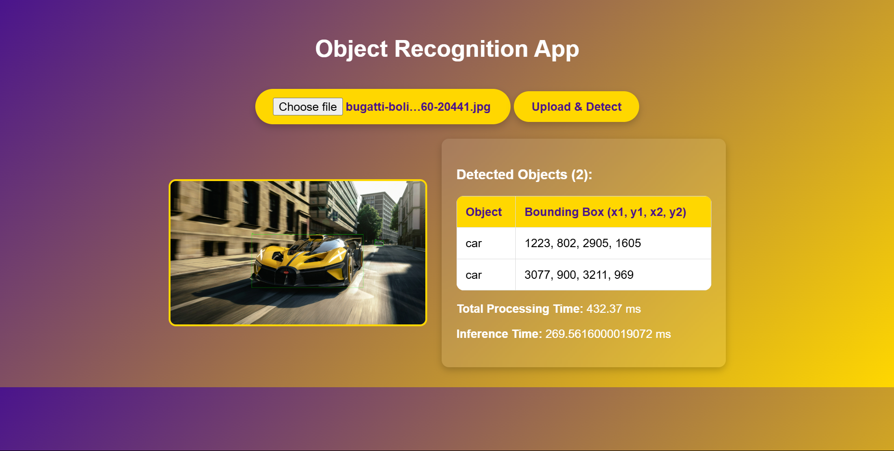
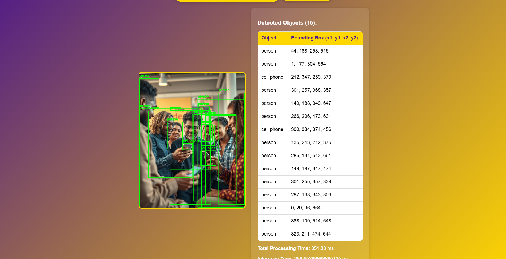
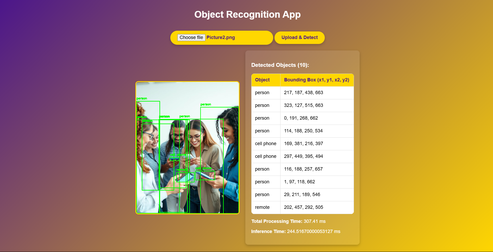

# 🎯 Object Recognition AI with Machine Learning 🚀

## 📌 Project Overview

🚀 **Goal:** Develop an AI-powered object recognition system that detects and classifies objects in images.

🔍 **Features:**  
✔️ Upload an image and detect objects automatically  
✔️ Machine Learning model for accurate recognition  
✔️ Flask-based backend for seamless processing  
✔️ Interactive and user-friendly UI  
✔️ Bounding box visualization for detected objects  

---

## 🛠 Installation of Dependencies

📌 Install dependencies using the following command:

```bash
pip install -r requirements.txt
```

---

## 🚀 Steps to Run the Project

✅ Follow these steps to run the Object Recognition AI:

1️⃣ **Install dependencies:**
   ```bash
   pip install -r requirements.txt
   ```
2️⃣ **Run the Flask application:**
   ```bash
   python app.py
   ```
3️⃣ **Open the application:**  
   Open [http://127.0.0.1:5000/](http://127.0.0.1:5000/) in your browser 🌍.

---

## 🖼️ Sample Output

<p align="center">
  
</p>
<p align="center">
  
</p>
<p align="center">
  
</p>

---

## 💻 Technology Stack

| Category        | Technology Used |
|----------------|----------------|
| Frontend       | HTML, CSS, JavaScript 🎨 |
| Backend        | Flask (Python) ⚙️ |
| Machine Learning | YOLO/SSD/Faster R-CNN 🤖 |
| API Integration | OpenCV🌍 |

---

## 🛠 I Code With

<div align="center">
  
  
  
  
  
  
  
  
  
  


---

## 🎯 Future Improvements

🔹 Improve object detection accuracy with custom-trained models  
🔹 Implement real-time object detection with video streams  
🔹 Deploy the application on a cloud platform for accessibility  

📢 Contributions & Suggestions are welcome! Feel free to fork and create a pull request.  

---

### ⭐ Don't forget to **star** this repository if you found it useful! 😊
